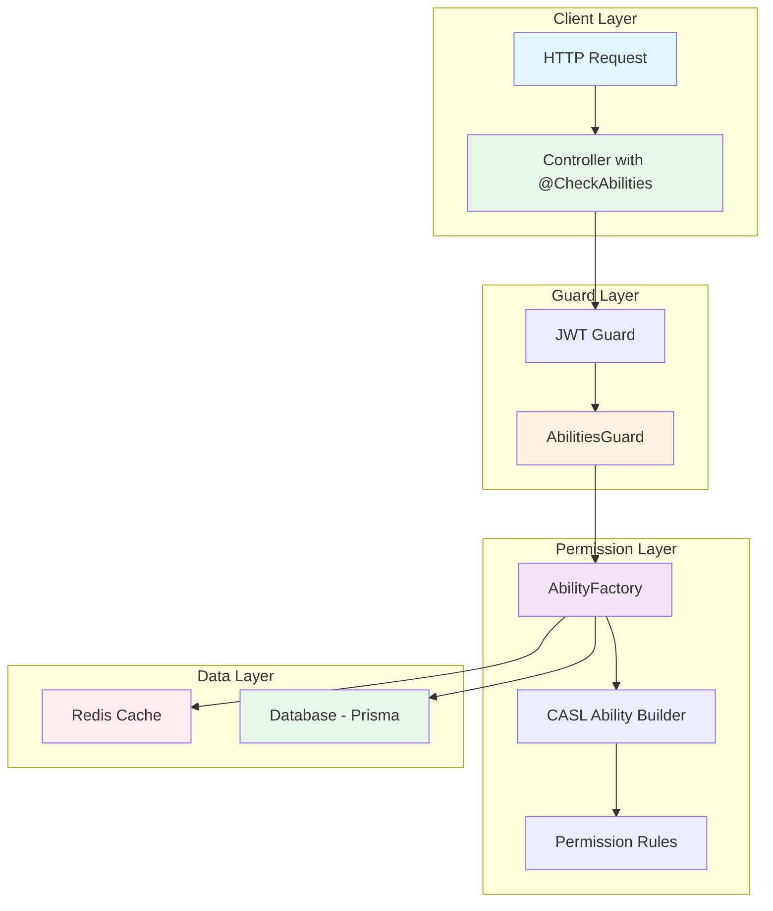
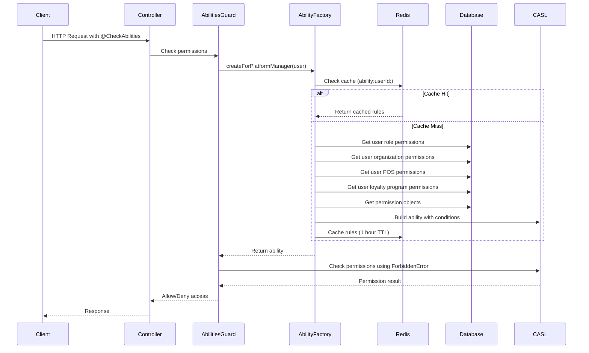
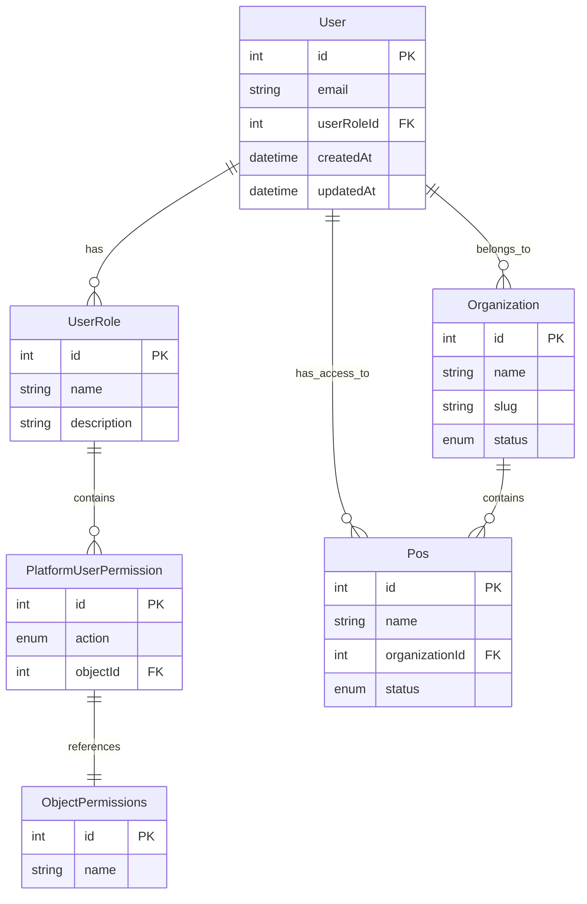
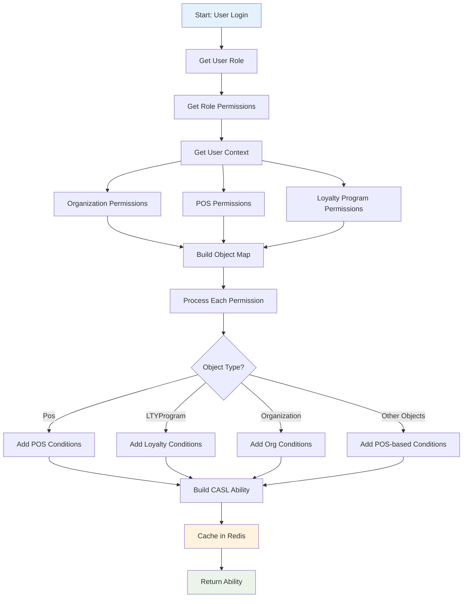
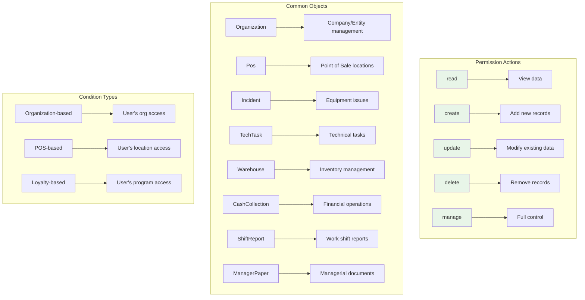

# Platform User Permission System - Visual Representation

## 1. System Architecture Overview



## 2. Permission Flow Diagram



## 3. Database Schema Relationships



## 4. Permission Building Process



## 5. Permission Condition Logic

```mermaid
graph LR
    subgraph "Permission Conditions"
        A[Pos Object] --> B[id: {in: posCondition}<br/>organizationId: {in: orgCondition}]
        
        C[LTYProgram Object] --> D[id: {in: loyaltyProgramCondition}]
        
        E[Organization Object] --> F[id: {in: orgCondition}]
        
        G[Other Objects<br/>Incident, TechTask,<br/>Warehouse, etc.] --> H[posId: {in: posCondition}]
    end
    
    subgraph "User Context"
        I[User ID] --> J[Role Permissions]
        J --> K[Organization Access]
        J --> L[POS Access]
        J --> M[Loyalty Access]
    end
    
    style A fill:#e8f5e8
    style C fill:#e8f5e8
    style E fill:#e8f5e8
    style G fill:#e8f5e8
    style I fill:#e3f2fd
```

## 6. Controller Usage Examples

```mermaid
graph TD
    subgraph "Controller Methods"
        A[@Get('/pos/:id')<br/>@CheckAbilities(new ReadPosAbility())]
        
        B[@Post('/incident')<br/>@CheckAbilities(new CreateIncidentAbility())]
        
        C[@Patch('/organization/:id')<br/>@CheckAbilities(new UpdateOrgAbility())]
        
        D[@Delete('/loyalty/:id')<br/>@CheckAbilities(new DeleteLoyaltyAbility())]
    end
    
    subgraph "Guard Processing"
        E[Extract @CheckAbilities metadata]
        E --> F[Get user from request]
        F --> G[Build ability for user]
        G --> H[Check each permission rule]
        H --> I[Allow/Deny access]
    end
    
    A --> E
    B --> E
    C --> E
    D --> E
    
    style A fill:#e8f5e8
    style B fill:#e8f5e8
    style C fill:#e8f5e8
    style D fill:#e8f5e8
    style E fill:#fff3e0
```

## 7. Caching Strategy

```mermaid
graph LR
    subgraph "Cache Key Structure"
        A[ability:userId:timestamp]
    end
    
    subgraph "Cache Operations"
        B[Check Cache] --> C{Cache Hit?}
        C -->|Yes| D[Return Cached Rules]
        C -->|No| E[Build New Ability]
        E --> F[Serialize Rules to JSON]
        F --> G[Store in Redis (1 hour TTL)]
        G --> H[Return New Ability]
    end
    
    subgraph "Cache Benefits"
        I[Reduce Database Queries]
        J[Faster Permission Checks]
        K[Lower Latency]
    end
    
    A --> B
    D --> I
    H --> I
    I --> J
    J --> K
    
    style A fill:#e3f2fd
    style I fill:#e8f5e8
    style J fill:#e8f5e8
    style K fill:#e8f5e8
```

## 8. Permission Types and Actions



## Key Insights

1. **Multi-layered Security**: JWT → Role → Permission → Object → Condition
2. **Context-aware Permissions**: User's organization, POS, and loyalty program access
3. **Performance Optimization**: Redis caching with 1-hour TTL
4. **Flexible Architecture**: Easy to add new objects and permission types
5. **Complex Business Logic**: Hardcoded conditions for different object types
6. **CASL Integration**: Leverages CASL's powerful permission engine
7. **NestJS Integration**: Clean integration with guards and decorators

## Areas for Improvement

1. **Dynamic Conditions**: Replace hardcoded business logic with configuration
2. **Performance**: Optimize database queries and reduce N+1 problems
3. **Type Safety**: Improve TypeScript types and reduce `any` usage
4. **Testing**: Add comprehensive unit tests for permission logic
5. **Monitoring**: Add permission check logging and performance metrics
